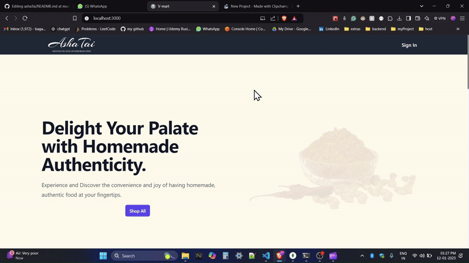

# AshaTai: Homemade Snacks and Food Website

 This repo contains the code for the frontend and backend of AshaTai, a website that sells homemade snacks and food.  The website is hosted on [https://asha-tai.vercel.app/](https://asha-tai.vercel.app/).

## Table of Contents

- [Tech Stack](#tech-stack)
  - [Frontend](#frontend)
  - [Backend](#backend)
- [Features](#features)
  - [Frontend](#frontend-1)
  - [Backend](#backend-1)
- [Usage](#usage)
- [Environment Variables](#environment-variables)
  - [Frontend](#frontend-2)
  - [Backend](#backend-2)
- [Screenshots and Video Demo](#screenshots-and-video-demo)
- [License](#license)

## Tech Stack

### Frontend

- React
- React Router DOM
- Redux Toolkit
- Tailwind CSS
- Ant Design
- Cashfree Payments
- Firebase
- Flowbite
- AOS
- JSON Server

### Backend

- Node.js
- Express.js
- Nodemailer
- Mongoose
- Bcrypt for password hashing
- Cashfree APIs for payment integration

## Features

### Frontend

- User authentication and authorization using Firebase Authentication and Redux Toolkit.
- Payment integration using Cashfree Payments.
- Responsive design using Tailwind CSS and Flowbite.
- Dynamic data fetching using JSON Server.
- Form validation using React Hook Form.
- Captcha verification using hCaptcha and react-simple-captcha.
- Toast notifications using react-hot-toast.

### Backend

- Full CRUD APIs for products, orders, and product categories.
- Signing in and signing up users with password hashing.
- Cashfree payment integration.
- Sorting and pagination logic for both products and order APIs.
- Sending emails on order confirmation.
- Resetting passwords.
- And more!

## Usage

To use this repo, follow these steps:

1. Clone the repository to your local machine.
2. Initialize the submodules by running `git submodule update --init --recursive`.
3. Create a `.env` file in the each subdirectory i.e in frontend as well as backend and add the mentioned environment variables (See Environment Variables section).
4. Install dependencies by running `npm install` in both the frontend and backend directories.
5. Start the frontend by running `npm start` in the `frontend` directory.
6. Start the backend by running `node server.js` in the `backend` directory.

## Environment Variables

To run the project, you'll need to add the following environment variables to your `.env` file for each directory:

### Frontend

- `REACT_APP_BACKEND_URL`: The URL of the backend API to use for the app.
- `REACT_FIREBASE_APIKEY`: The API key for your Firebase project.
- `REACT_FIREBASE_AUTHDOMAIN`: The authentication domain for your Firebase project.
- `REACT_FIREBASE_PROJECTID`: The project ID for your Firebase project.
- `REACT_FIREBASE_STORAGEBUCKET`: The storage bucket for your Firebase project.
- `REACT_FIREBASE_MESSAGINGSENDERID`: The messaging sender ID for your Firebase project.
- `REACT_FIREBASE_APPID`: The app ID for your Firebase project.
- `REACT_APP_ADD_PRODUCT_PASSWORD`: The password for admin to add new password

### Backend

- `MONGODB_DATABASE_URL`: your_mongodb_url.
- `CASHFREE_APP_ID`: your_cashfree_app_id.
- `CASHFREE_SECRET_KEY`: your_cashfree_secret_key.
- `NODEMAILER_MAIL`: your_email_to_send_mails.
- `NODEMAILER_MAIL_PASSWARD`: your_mail_passward.

## Demo

### Overview of HomePage

### Filtering on products

### Ordering of product with payment thorugh cashfree drop component

## License

This project is licensed under the MIT License.

Made with ❤️ by [@vaibhav25-mnnit](https://github.com/vaibhav25-mnnit)
